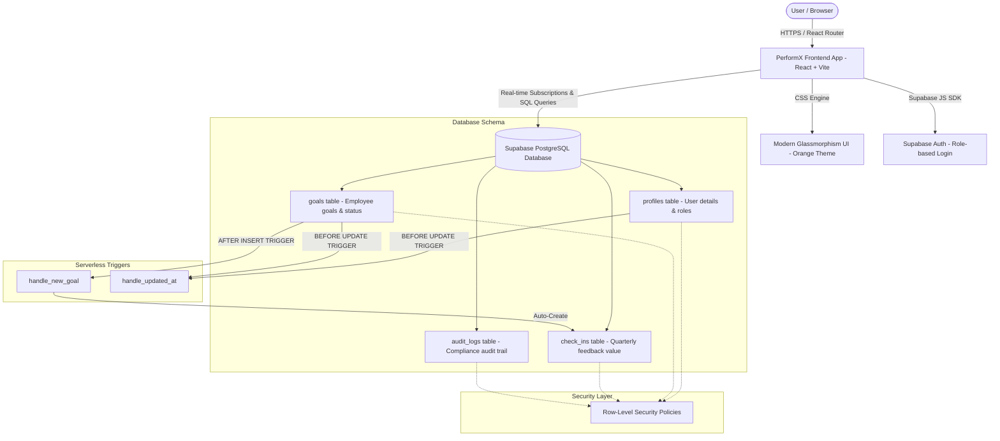

# PerformX Project Submission Prep Guide

This document contains **all the gathered project information** for your Goal-Setting Portal (PerformX) and a **custom, optimized prompt** that you can copy-paste into Claude to generate a stunning, professional Word Document.

---

## 1. Quick Copy: All Project Information
Here is all the technical data we collected from your repository:

### Core Project Information
* **Project Name:** PerformX Enterprise Performance & Goal Tracking Portal
* **Student Name:** Priyanshu Sharma
* **College:** Manipal University Jaipur (MUJ)
* **Tech Stack:**
  * **Frontend:** React, Vite, TailwindCSS & Vanilla CSS (Optimized for standard Light Mode for high-contrast enterprise clarity)
  * **Backend Database:** Powered by Live Supabase PostgreSQL Cloud Database
  * **Security Layer:** Row-Level Security (RLS) policies on all tables ensuring secure data compartmentalization

### Essential Links
* **Live Application URL:** [https://priyanshu-130.github.io/Goal-Setting-Portal/](https://priyanshu-130.github.io/Goal-Setting-Portal/)
* **Source Code Repository:** [https://github.com/priyanshu-130/Goal-Setting-Portal](https://github.com/priyanshu-130/Goal-Setting-Portal)
* **Backend Database Host:** Supabase PostgreSQL Cloud Engine (`https://exlecxzqorbkniwzocux.supabase.co`)

### User Personas & Login Credentials
To make evaluation seamless for evaluators/judges, the app includes **pre-seeded "One-Click" role selectors** on the login page. However, manual logins are fully supported:
1. **Employee Workspace (Harshi Sharma)**
   * **Email:** `harshi@demo.com`
   * **Password:** `demo123`
   * **Key Workflow:** Personal goal-setting, weightage validation (must total 100%), and quarterly achievement check-in verification requests.
2. **Manager Dashboard (Janhvi Singh)**
   * **Email:** `janhvi@demo.com`
   * **Password:** `demo123`
   * **Key Workflow:** Team oversight, inline goal approval/rework workflow, feedback check-in logs, and performance metrics.
3. **Admin Console (Anshu Kumari)**
   * **Email:** `anshu@demo.com`
   * **Password:** `demo123`
   * **Key Workflow:** Organizational governance dashboard, shared KPI distribution, active schedule cycle configuration, and system-wide security audit logs.

### Database Architecture (Supabase SQL Schema)
The system utilizes 4 relational tables, fully protected with PostgreSQL Row Level Security (RLS) Policies and triggers:
* **`profiles`:** Stores user roles and organizational hierarchy.
  * Columns: `id (UUID PRIMARY KEY)`, `name (TEXT)`, `email (TEXT)`, `role (TEXT: employee/manager/admin)`, `designation (TEXT)`, `department (TEXT)`, `manager_id (UUID)`, `avatar_url (TEXT)`.
* **`goals`:** Stores employee goal details, weights, and status.
  * Columns: `id (UUID PRIMARY KEY)`, `employee_id (UUID)`, `title (TEXT)`, `description (TEXT)`, `thrust_area (TEXT)`, `unit (TEXT)`, `target (TEXT)`, `weightage (INTEGER)`, `status (TEXT: draft/submitted/approved/rejected)`, `is_shared (BOOLEAN)`, `manager_comment (TEXT)`.
* **`check_ins`:** Stores quarterly updates.
  * Columns: `goal_id (UUID PRIMARY KEY)`, `q1 (JSONB)`, `q2 (JSONB)`, `q3 (JSONB)`, `q4 (JSONB)`.
* **`audit_logs`:** Secure compliance trail for admin view.
  * Columns: `id (UUID PRIMARY KEY)`, `action (TEXT)`, `actor (TEXT)`, `details (TEXT)`, `timestamp (TIMESTAMPTZ)`.

---

## 2. Copy-Paste Claude Prompt

Copy the entire block below and paste it into **Claude** to generate your Word Document report.

```text
Please write a highly professional, comprehensive, executive-ready technical project report for my hackathon submission. Format it cleanly in standard Markdown with structured headings, sub-headings, clean tables, and bullet points so that I can copy and paste the entire output directly into Microsoft Word, and it will automatically map to Word's headings and document style perfectly.

Use the following detailed project data to build the report:

### PROJECT DETAILS
- Project Title: PerformX Enterprise Performance & Goal Tracking Portal
- Student Name: Priyanshu Sharma
- College: Manipal University Jaipur (MUJ)
- Live Application URL: https://priyanshu-130.github.io/Goal-Setting-Portal/
- Source Code Repository: https://github.com/priyanshu-130/Goal-Setting-Portal
- Backend: Live Supabase PostgreSQL database with Row-Level Security (RLS)

### KEY SYSTEM USER ROLES
1. Employee Workspace (Harshi Sharma - harshi@demo.com / demo123)
   - Capabilities: High-fidelity goal creation, self-assessment trackers, thrust area alignment, automatic weightage calculation (system enforces exactly 100% total weightage before submission), and quarterly progress check-ins (Q1-Q4).
2. Manager Dashboard (Janhvi Singh - janhvi@demo.com / demo123)
   - Capabilities: Direct team goal reviews, inline approval/rejection, "Return for Rework" comment system, real-time KPI progress tracking charts, and quarterly check-in verification logs.
3. Admin Console (Anshu Kumari - anshu@demo.com / demo123)
   - Capabilities: High-level organizational dashboard with metrics, enterprise CSV/Excel report exports (built-in export tracking), departmental KPI distribution, active schedule cycle configuration, and security audit log tracking.

### TECHNICAL SCHEMA (DATABASE STRUCTURE)
1. 'profiles' table: id (UUID, PK), name (TEXT), email (TEXT), role (TEXT: employee/manager/admin), designation (TEXT), department (TEXT), manager_id (UUID, FK), avatar_url (TEXT).
2. 'goals' table: id (UUID, PK), employee_id (UUID, FK), title (TEXT), description (TEXT), thrust_area (TEXT), unit (TEXT), target (TEXT), weightage (INTEGER), status (TEXT: draft/submitted/approved/rejected), is_shared (BOOLEAN), manager_comment (TEXT).
3. 'check_ins' table: goal_id (UUID, PK, FK), q1, q2, q3, q4 (JSONB stores progress).
4. 'audit_logs' table: id (UUID, PK), action (TEXT), actor (TEXT), details (TEXT), timestamp (TIMESTAMPTZ).

---

### DOCUMENT STRUCTURE TO GENERATE:
Please generate a report containing the following chapters/sections:

1. EXECUTIVE SUMMARY
   - Write a high-quality 2-paragraph overview explaining what the Goal-Setting Portal (PerformX) does, its purpose of solving goal alignment, weight verification, and continuous appraisal in enterprise organizations, and its high-end modern UX.

2. SYSTEM ARCHITECTURE
   - Describe a standard three-tier web application architecture:
     - Frontend Presentation Layer: React 18, Vite (super fast bundling), custom CSS engine with beautiful premium typography and orange/gold professional color theme.
     - Application & Security Layer: Supabase JS Client, Authentication handler, Row-Level Security (RLS) policies protecting employee data.
     - Database Storage Layer: PostgreSQL hosting 4 relational tables (profiles, goals, check_ins, audit_logs) with PL/pgSQL database triggers for automated check-in creation and timestamp synchronization.
   - Design a clean text-based / ASCII architecture flow diagram inside this section so it looks gorgeous.

3. KEY FEATURES & HIGHLIGHTS
   - Describe the major premium features we built:
     - Enforced Weightage Checking: Auto-sum rules ensuring goals total exactly 100% weightage before letting employees submit.
     - Dynamic Progress Scoring & Units: Support for numeric, percentage, and currency targets.
     - Interactive Approval & Rework Workflows: Manager inline approval comments with instant status changes.
     - Advanced Audit Logging: Compliance logs tracking every critical event.
     - Enterprise Report Export: CSV and Excel export system with real-time status and telemetry logs for managers/admins.

4. DATABASE SCHEMA DESCRIPTION (Include tables of columns with descriptions)
   - Create 4 beautiful Markdown tables describing the fields and datatypes of 'profiles', 'goals', 'check_ins', and 'audit_logs'. Explain the Row Level Security (RLS) setup (e.g. employees can only see their own goals, managers can see their team's goals, admins can see all).

5. USER JOURNEYS & TESTING CREDENTIALS
   - Explain the 3 roles and their exact test credentials (harshi@demo.com, janhvi@demo.com, anshu@demo.com) so the judges can login easily. Describe a step-by-step test journey they can take (Employee drafts & submits -> Manager reviews & rework/approves -> Admin views audit trail and exports report).

6. CONCLUSION & FUTURE ENHANCEMENTS
   - Provide a professional closing summarizing how PerformX successfully achieves the goals of modern continuous performance management (CPM) and suggest future enhancements (e.g., AI-assisted smart goal generation, calendar integration).

Be extremely verbose, detailed, professional, and thorough so the document is substantial (around 1500-2000 words). Make the tone highly academic and industry-professional.
```

---

## 3. Visual Architecture Diagram
If you want to attach an architecture diagram as an image or PDF (Deliverable #3), you can copy this Mermaid diagram below, paste it into [Mermaid Live Editor](https://mermaid.live), and export it as a beautiful SVG, PNG, or PDF!


